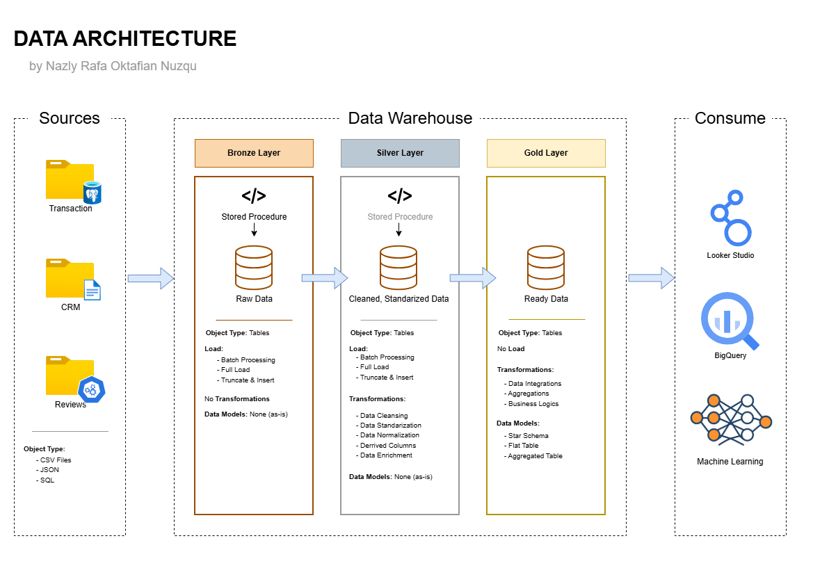

# Retail E-Commerce Data Warehouse & Analytics Project

Welcome to my **Retail E-Commerce Data Warehouse** repository! 🛒📦
This is an end-to-end data engineering portfolio project: from designing a multi-source data architecture, building ETL pipelines, transforming data with dbt, to (in progress) orchestrating everything with Airflow and visualizing it in Looker Studio.

This repository **intentionally splits one dataset into three separate source systems** (PostgreSQL, CSV, JSON) to realistically simulate how data actually arrives in a company — from an OLTP database, a partner's flat-file export, and a third-party API-style feed. The goal is to demonstrate genuine **multi-source extraction skills**, not just a single ingestion path.

## 🏗️ Data Architecture

This project follows the **Medallion Architecture**: Bronze, Silver, and Gold layers built on BigQuery.


1. **Bronze Layer** — Raw data as extracted from each source system, loaded 1:1 with no transformation.
2. **Silver Layer** — Cleaned, standardized, deduplicated, and validated data. Table names mirror Bronze for clear lineage.
3. **Gold Layer** — Business-ready star schema (`dim_*` / `fact_*`) designed for analytics and dashboards.

*(Diagram placeholder — see `docs/ERD_Data_Warehouse.drawio.png` and `docs/Data_Integration.drawio.png`)*

---

## 🔀 Why Three Sources? — The Data Integration Design

The source dataset is the [Brazilian E-Commerce Public Dataset by Olist](https://www.kaggle.com/datasets/olistbr/brazilian-ecommerce) (Kaggle), but instead of loading it as-is, it was **deliberately re-mapped into three realistic source systems**:

| Source | Business Role | Tables / Files |
|---|---|---|
| **PostgreSQL** (Docker) | Core OLTP transactional system | `customers`, `products`, `orders`, `order_items`, `order_payments` |
| **CSV** | Partner/seller management system, exported periodically | `sellers.csv`, `geolocation.csv` |
| **JSON** | Third-party review service (API-style feed) | `reviews.json` (converted from `order_reviews.csv`) |

Key modeling decisions from the ERD:
- `customer_id` is unique **per order**, while `customer_unique_id` is unique **per person** (an Olist dataset quirk, handled explicitly).
- `order_item_id` is a sequence number **within an order**, not a global ID → composite PK `(order_id, order_item_id)`.
- Payments can be **split across multiple rows** → composite PK `(order_id, payment_sequential)`.
- `seller_id` in `order_items` has **no FK constraint**, since sellers live in a separate source system (CSV) — a deliberate cross-source integrity trade-off, documented rather than silently ignored.
- `product_category_name_translation.csv` was **not modeled as a relational table** (no PK/FK in the source, just a 2-column lookup) — kept as plain text and handled at the dbt layer if needed.

---

## 🛠️ Tech Stack

| Layer | Tools |
|---|---|
| Source Systems | PostgreSQL (Docker), CSV files, JSON file |
| Extraction | Python (`pandas`, `psycopg2`) |
| Staging | Google Cloud Storage (date-partitioned Parquet) |
| Data Warehouse | BigQuery (`bronze`, `silver`, `gold` datasets) |
| Transformation | dbt Core (`dbt-bigquery`) + `dbt-utils`, `dbt-expectations`, `dbt-date` |
| Orchestration | Apache Airflow (LocalExecutor, Docker Compose) — *in progress* |
| Containerization | Docker + Docker Compose |
| Visualization | Looker Studio |
| Version Control | Git + GitHub |

---

## 📖 Project Overview

This project covers the full data engineering lifecycle:

1. **Data Architecture** — Designing a medallion warehouse from a multi-source ERD.
2. **ETL Pipelines** — Extracting from 3 heterogeneous sources, staging to GCS, loading to BigQuery Bronze.
3. **Data Quality** — Profiling across 6 dimensions (completeness, uniqueness, validity, consistency, referential integrity, date logic) with documented, justified fixes — see [`docs/dq_findings_and_decisions.md`](docs/dq_findings_and_decisions.md).
4. **Data Modeling** — Silver (cleaned) → Gold (star schema) using dbt, with surrogate keys and `dwh_` technical columns.
5. **Testing** — dbt tests (`unique`, `not_null`, `accepted_values`, `relationships`) across Silver and Gold.
6. **(Planned) Orchestration & BI** — Airflow DAG and Looker Studio dashboards.

🎯 This repository demonstrates skills relevant to:
- Data Engineering / ETL Pipeline Development
- Data Modeling (star schema, medallion architecture)
- Data Quality Engineering
- SQL / dbt Development
- Cloud Data Warehousing (GCP: GCS + BigQuery)

---

## 📂 Repository Structure

```
retail-ecommerce-data-warehouse/
│
├── datasets/raw/olist_kaggle/       # Original 9 Kaggle CSV files
├── datasets/raw/file_sources/       # sellers.csv, geolocation.csv, reviews.json
│
├── db/
│   ├── schema.sql                   # PostgreSQL DDL (5 tables)
│   └── setup_postgres.py            # Re-run schema without resetting Docker volume
│
├── setup/                           # One-time seeding scripts
│   ├── migrate_to_postgres.py
│   ├── convert_reviews_to_json.py
│   ├── copy_flat_sources.py
│   └── setup_bigquery.py
│
├── extract/                         # Recurring extraction scripts (Airflow-ready)
│   ├── extract_postgres.py
│   ├── extract_csv.py
│   └── extract_json.py
│
├── staging/
│   └── gcs_upload.py                # Parquet → GCS landing zone (date-partitioned)
│
├── load/
│   └── bigquery_loader.py           # GCS → BigQuery Bronze (WRITE_TRUNCATE)
│
├── dbt_project/
│   ├── models/silver/                # 8 models
│   ├── models/gold/                  # 8 models (dim_* + fact_*)
│   ├── macros/generate_schema_name.sql
│   └── dbt_project.yml, packages.yml, profiles.yml.example
│
├── docs/
│   ├── naming_conventions.md
│   ├── dq_findings_and_decisions.md
│   ├── gcp_trial_reset_runbook.md
│   ├── data_quality_check.py / dq_report.txt
│   ├── ERD_Data_Warehouse.drawio.png
│   └── Data_Integration.drawio.png
│
├── src/notebooks/01_data_understanding.ipynb      
├── docker-compose.yml
├── load_env.ps1
├── .env.example
└── README.md
```

---

## 🏷️ Naming Conventions

Full rules in [`docs/naming_conventions.md`](docs/naming_conventions.md). Summary:

| Layer | Pattern | Example |
|---|---|---|
| Bronze | `<source_system>_<entity>` | `postgres_orders` |
| Silver | `<source_system>_<entity>` (same as Bronze, for lineage) | `postgres_orders` |
| Gold Dimension | `dim_<entity>` | `dim_customers` |
| Gold Fact | `fact_<entity>` | `fact_sales` |
| Surrogate Key | `<entity>_key` | `customer_key` |
| Technical Column | `dwh_<column_name>` | `dwh_load_date` |

---

## ✅ Progress Status

**Done:**
- [x] Data architecture design (ERD + integration diagrams)
- [x] Naming conventions documented
- [x] PostgreSQL via Docker Compose (auto-init schema)
- [x] Source seeding — PostgreSQL, CSV, JSON all populated & verified (~99,441 orders)
- [x] Extraction scripts (3 sources → Parquet with `dwh_extracted_at` / `dwh_source_system`)
- [x] GCS + BigQuery infra (bronze/silver/gold datasets)
- [x] `gcs_upload.py` and `bigquery_loader.py`
- [x] dbt project scaffolding
- [x] 8 Silver models — cleaning logic + DQ fixes applied
- [x] 8 Gold models written
- [x] Full DQ profiling across 6 dimensions, 8 datasets — see [findings doc](docs/dq_findings_and_decisions.md)
- [x] dbt tests across Silver & Gold
- [x] **Silver layer: 8/8 models passing**
- [x] **Gold layer: 6/8 models passing** — `dim_customer`, `dim_products`, `dim_sellers`, `dim_geography`, `dim_date`, `fact_reviews`
- [x] `dbt test` at 100% pass rate across Silver + Gold

**In progress:**
- [ ] Airflow DAG (`dags/retail_dwh_pipeline.py`) + Airflow service in `docker-compose.yml`
- [ ] Push initial commit to GitHub
- [ ] Looker Studio dashboards
- [ ] `dbt docs generate` (lineage graph)
- [ ] GitHub Actions CI (`dbt test` on push)

---

## ⚙️ Setup (Local)

> Requires Docker Desktop, Python 3.10+, a GCP project with BigQuery + GCS enabled, and dbt Core.

```bash
# 1. Start PostgreSQL
docker compose up -d

# 2. One-time seeding
python setup/migrate_to_postgres.py
python setup/convert_reviews_to_json.py
python setup/copy_flat_sources.py
python setup/setup_bigquery.py

# 3. Extract → stage → load
python extract/extract_postgres.py
python extract/extract_csv.py
python extract/extract_json.py
python staging/gcs_upload.py
python load/bigquery_loader.py

# 4. Transform (PowerShell — dbt does not auto-read .env)
. .\load_env.ps1
cd dbt_project
dbt deps
dbt run
dbt test
```

Note: PostgreSQL is remapped to port `5433` locally (not the default `5432`) to avoid conflicting with a native install — see `.env.example`.

---

## 🗺️ Data Quality Approach

Full findings and rationale in [`docs/dq_findings_and_decisions.md`](docs/dq_findings_and_decisions.md). Highlights:

- **Anomalies over silent drops** — e.g. 166 orders with a delivery-before-purchase date logic error are flagged (`dwh_is_date_anomaly`), not deleted.
- **Explicit "unknown" buckets** — products missing category data keep their sales history visible in `fact_sales` instead of being excluded from joins.
- **Deduplication with a documented rule** — 814 duplicate `review_id` rows deduplicated by most recent `review_answer_timestamp` using `QUALIFY ROW_NUMBER()`.
- **Bounded domains enforced as dbt tests**, not hardcoded transformations (`order_status`, `payment_type`, `customer_state`, `seller_state`, `review_score`).

---

## 🌟 About Me

Built by **Raffa**, a semester 7 student pursuing Data Engineering (alongside Data Engineering). This is one of two active portfolio tracks — Data Engineering and Data Analytics — built to demonstrate practical, end-to-end pipeline skills using a real-world-style dataset.

- GitHub: [rfaoktvian](https://github.com/rfaoktvian)
- Repo: [retail-ecommerce-data-warehouse](https://github.com/rfaoktvian/retail-ecommerce-data-warehouse)
